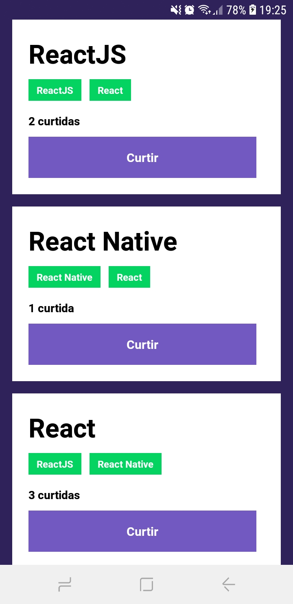

# 🚀 Desafio: Conceitos do React Native aplicado no Bootcamp GoStack

## 🔖 Sobre

Nesse desafio era preciso listar os repositórios da api e mostrar em tela com um botão de curtir, junto com as techs e o título.

## 📷 Screenshot:

### Além do desafio

💻 Adicionei um tema diferente em tela.

    
    

# 🚀 Tecnologias
<ul>
    <li>✔️ React Native</li>
    <li>✔️ NodeJS</li>
    <li>✔️ Axios</li>
</ul>

# 

<h3 align="center"> Made with 💜 by <a href="https://www.linkedin.com/in/pedro-lucas-4b2941199/">Pedro Lucas</a></h3>